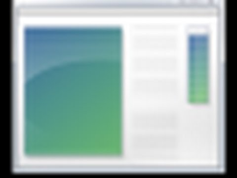

# svelte-windows

[](https://www.npmjs.com/package/svelte-windows)
[](./LICENSE.md)

Draggable, resizable desktop-style windows for Svelte 5. Built for overflow layouts, touch interaction, and intelligent active-window stacking.

## Preview



## Install

```bash
npm install svelte-windows
```

## Quick start

```svelte
<script lang="ts">
    import { WindowManager, Window } from "svelte-windows";

    const dragRegions = [{ width: "100%", height: "40px", top: "0px", left: "0px" }];
</script>

<div style="width: 640px; height: 480px;">
    <WindowManager>
        {#snippet children(context)}
            <Window
                id="window-1"
                {context}
                windowDragRegions={dragRegions}
                outerClassName="shadow-2xl"
            >
                <section style="width: 100%; height: 100%; background: #111827;">
                    My window content
                </section>
            </Window>
        {/snippet}
    </WindowManager>
</div>
```

## Why use it

- Drag and resize windows in bounded desktop regions
- Edge and corner resize handles with mouse + touch support
- Automatic active window stacking and z-order management
- iframe-safe focus handling (clicking iframes still activates the parent window)
- Bindable `top`, `left`, `width`, and `height` for external state sync
- Style hooks for both window shell and inner content

## Lifecycle callbacks

`Window` supports optional callbacks:

- `onActiveStateChanged(isActive)`
- `onDragStart({ top, left })`
- `onDragEnd({ top, left })`
- `onResizeStart({ width, height })`
- `onResizeEnd({ width, height })`

## API exports

```ts
import {
    WindowManager,
    Window,
    MouseContext,
    WindowContext,
    INACTIVE_MOUSE_ID,
    type WindowDragConfig,
    type WindowPosition,
    type WindowDimensions,
    type ActualWindowProps
} from "svelte-windows";
```

## Documentation

- Website: [windows.stephengruzin.dev](https://windows.stephengruzin.dev)
- Docs page: [windows.stephengruzin.dev/docs](https://windows.stephengruzin.dev/docs)
- Playground: [windows.stephengruzin.dev/playground](https://windows.stephengruzin.dev/playground)

## Development

```bash
npm install
npm run dev
```

## License

[MIT](./LICENSE.md)